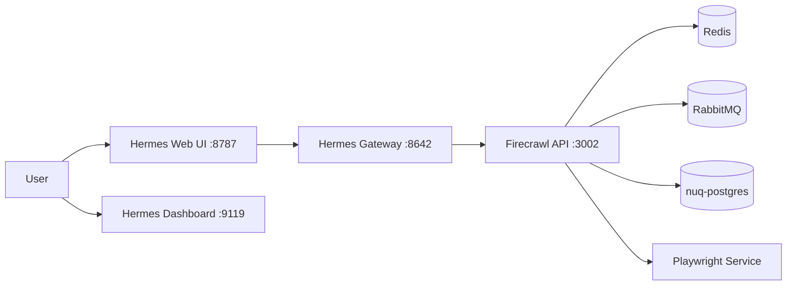

# 🧠 Hermes Config

Production-oriented Docker Compose setup for running a local Hermes Agent stack with:

- Hermes Gateway (agent runtime)
- Hermes Web UI
- Hermes Dashboard
- Firecrawl scraping/extraction services
- Redis, RabbitMQ, and tuned PostgreSQL (nuq)

This repository gives you a repeatable way to spin up an integrated agent + crawling environment for local development or self-hosted usage.

## 📚 Table of Contents

- [Overview](#overview)
- [Architecture](#architecture)
- [Repository Structure](#repository-structure)
- [Prerequisites](#prerequisites)
- [Quick Start](#quick-start)
- [Configuration](#configuration)
- [Operations](#operations)
- [Data and Volumes](#data-and-volumes)
- [Troubleshooting](#troubleshooting)
- [License](#license)

## 🧭 Overview

The stack is split across two Compose files:

- `compose.yaml`: Hermes services (`agent`, `webui`, `dashboard`)
- `compose.fireclaw.yaml`: Firecrawl + dependencies (`firecrawl`, `playwright-service`, `redis`, `rabbitmq`, `nuq-postgres`)

`Taskfile.yaml` provides shortcuts to build/start/stop/clean the full stack.

## 🏗️ Architecture



Notes:

- 🔌 Hermes and Firecrawl run on separate Docker networks.
- 🌐 Hermes reaches Firecrawl through `FIRECRAWL_API_URL` (default in this repo uses `host.docker.internal`).

## 🗂️ Repository Structure

```text
.
|- compose.yaml                  # Hermes services
|- compose.fireclaw.yaml         # Firecrawl services and dependencies
|- Taskfile.yaml                 # Task shortcuts (build/start/stop/clean)
|- Dockerfile.agent              # Custom Hermes agent image (adds chromium + ddgs)
|- Dockerfile.webui              # Custom Hermes webui image (adds chromium)
|- .env.example                  # Environment variable template
|- src/
|  |- config.yaml                # Hermes runtime configuration
`- apps/
	 `- nuq-postgres/
			|- Dockerfile              # Postgres image with pg_cron preload
			|- nuq.sql                 # Schema, indexes, and pg_cron jobs
			`- tuning.sql              # Cluster-level PostgreSQL tuning (ALTER SYSTEM)
```

## ✅ Prerequisites

- 🐳 Docker + Docker Compose plugin
- 🛠️ [Task](https://taskfile.dev/) (optional but recommended)
- 💻 macOS/Linux shell for `UID`/`GID` environment mapping

## ⚡ Quick Start

1. 📄 Copy environment template:

```bash
cp .env.example .env
```

2. ✍️ Update `.env` values as needed.

At minimum, verify:

- `FIRECRAWL_API_URL` points to your Firecrawl host port (typically `http://host.docker.internal:3002` in this setup)
- `OPENAI_API_KEY` and related model endpoint settings if you use OpenAI-compatible providers
- `POSTGRES_*` values if you want custom database credentials

3. ▶️ Start the stack:

```bash
task start
```

If you do not use Task:

```bash
docker compose -f compose.yaml -f compose.fireclaw.yaml up -d
```

4. 🌍 Open services:

- 🧑‍💻 Web UI: http://localhost:8787
- 📊 Dashboard: http://localhost:9119
- 🧠 Hermes Gateway health endpoint: http://localhost:8642
- 🕷️ Firecrawl API: http://localhost:3002

## ⚙️ Configuration

### 📝 Hermes config

Main Hermes runtime settings live in `src/config.yaml`, including:

- Model provider/default model
- Toolset enablement
- Web extraction backend (`firecrawl`)
- Search backend (`ddgs`)

### 🔐 Environment variables

Use `.env` to override Compose defaults.

Common variables:

- `FIRECRAWL_PORT`, `FIRECRAWL_INTERNAL_PORT`, `FIRECRAWL_API_URL`
- `OPENAI_BASE_URL`, `OPENAI_API_KEY`
- `POSTGRES_USER`, `POSTGRES_PASSWORD`, `POSTGRES_DB`
- `UID`, `GID` (for host/container file ownership alignment)

### 🗄️ PostgreSQL bootstrap

`apps/nuq-postgres/Dockerfile` builds a PostgreSQL 18 image that:

- Installs and preloads `pg_cron`
- Executes `nuq.sql` during init
- Executes `tuning.sql` during init

`nuq.sql` is written to be re-runnable and includes queue schema objects, indexes, retention cleanup jobs, and maintenance jobs.

## 🧰 Operations

### ⚡ Task shortcuts

```bash
task build   # Build images
task start   # Start all services
task stop    # Stop and remove containers
task clean   # Remove containers, volumes, images, orphans
```

### 🐳 Direct Compose commands

```bash
docker compose -f compose.yaml -f compose.fireclaw.yaml build --no-cache
docker compose -f compose.yaml -f compose.fireclaw.yaml up -d
docker compose -f compose.yaml -f compose.fireclaw.yaml down
docker compose -f compose.yaml -f compose.fireclaw.yaml down -v --rmi all --remove-orphans
```

## 💾 Data and Volumes

Persistent data mounts include:

- `${HERMES_HOME:-$HOME/.hermes}` for Hermes state
- `${HERMES_WORKSPACE:-$HOME/workspace}` for workspace sharing
- Named volume `hermes-agent` for agent assets

If you change host path ownership behavior, ensure `UID`/`GID` are set correctly.

## 🛟 Troubleshooting


- 🧑‍💻 Web UI is up but extraction fails:
	- Verify `FIRECRAWL_API_URL` and Firecrawl port mapping.
- 🔒 Permission issues in mounted folders:
	- Confirm `UID`/`GID` values in `.env`.
- 🕷️ Firecrawl boots but jobs fail:
	- Check `OPENAI_*` and proxy-related variables.
- ♻️ Clean rebuild needed:
	- Run `task clean` then `task build` and `task start`.

## 📄 License

This project is licensed under the terms described in [LICENSE](LICENSE).
